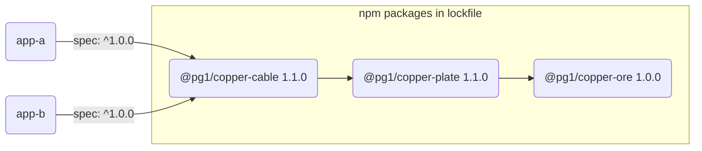
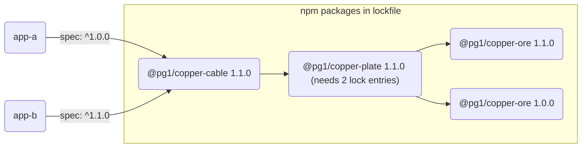

# Summary (friendly bug name: pocket-restrain)

Pnpm incorrectly updates transitive across workspace packages dependences > 2
layers deep ignoring previous locked versions.

Package layout before:


Package layout after bumping `app-b`'s spec to `^1.1.0` and running `pnpm i`':


Expected layout:


# Repro

1. run `pnpm install`
2. apply this patch (e.g. pipe to `git apply`):
```
diff --git a/packages/app-b/package.json b/packages/app-b/package.json
index 2f35b23..08f924e 100644
--- a/packages/app-b/package.json
+++ b/packages/app-b/package.json
@@ -1,6 +1,6 @@
 {
   "name": "app-b",
   "dependencies": {
-    "@pg1/copper-cable": "^1.0.0"
+    "@pg1/copper-cable": "^1.1.0"
   }
 }
```
3. run `pnpm install`
4. observe that `@pg1/copper-ore@1.0.0` disappears from the lockfile

